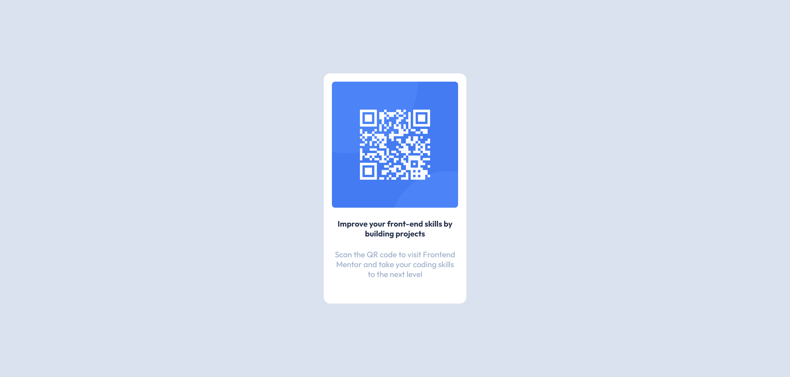

# Frontend Mentor - QR code component solution

This is a solution to the [QR code component challenge on Frontend Mentor](https://www.frontendmentor.io/challenges/qr-code-component-iux_sIO_H). 

### Screenshot

### Links

- Live Site URL: [https://karoljaworski.github.io/front-end-mentor-tasks/solutions/task1/](https://karoljaworski.github.io/FEM-QR-code-component/)

### Built with

- Semantic HTML5 markup
- Flexbox
